# Fitness Tracker (FitTrack)

**MVP - Minimum Viable Product**

- Front-End Application to be built with React
- Back-End Application to be built with Flask (Python) and Node/Bun
- PostgreSQL to be used as the Database Management System
- Implementation of JSON Web Token (JWT) Authentication to Sign Up, Sign In and Sign Out users
- Authorization of Users for back-end and front-end. Guest users that are not signed in should not be able to perform any CRUD functionality
- Full CRUD functionality on both back-end and front-end
- No secret keys to be held on front-end, only accessible on the back-end
- Deployment of App online

## Timeframe

2 weeks

## Technologies & Tools Used

- React JS, PostgreSQL (Neon Cloud Server and Beekeeper Studio for Visualisation), Node/Bun
- Flask with psycopg (Python)
- JSON Web Token (JWT) Authentication
- BCrypt for Password Encryption
- TanStack Query
- Axios (Data Fetching)
- Daisy UI with Tailwind (CSS)
- Jotai (Global State Management)
- Git & GitHub

## User Stories

### As a Guest:
- I would have to sign up/in before I can add/edit any workouts.
- I can view the Metabolic Equivalent of Task (MET) values for reference

### As a User, I want to:
- Securely login before accessing my personal workout data.
- View my own workout data history.
- Add my workout data with details, such as the workout type, duration, etc.
- Edit my workout data.
- Securely logout before ending the session.
- Automatically logout after a period of time/inactivity (i.e. 1 hour) using PyJWT's Expiration Functionality

### As an Admin, I want to:
- View all user accounts and their workout data for easy management.
- Delete erroneous users/workouts for moderation purposes.
- Create admin user accounts.

## Database Models/Schemas

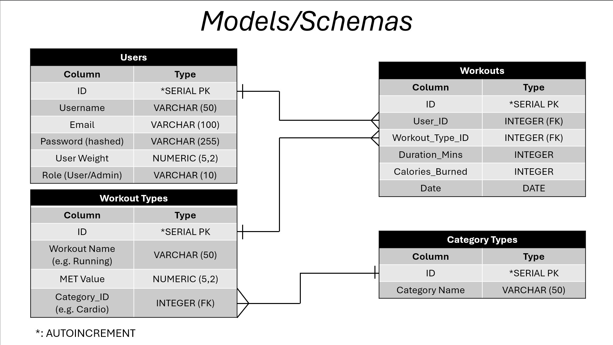

## Tree Structure of Pages/Components

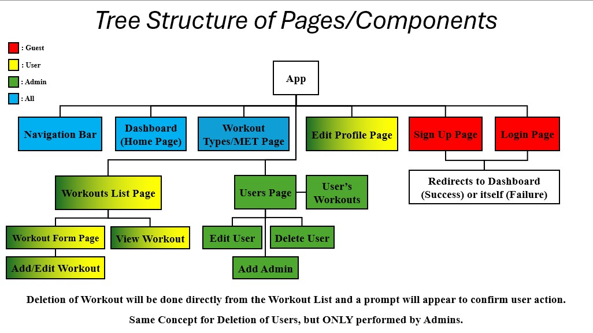

## Project Wireframes

### Guest

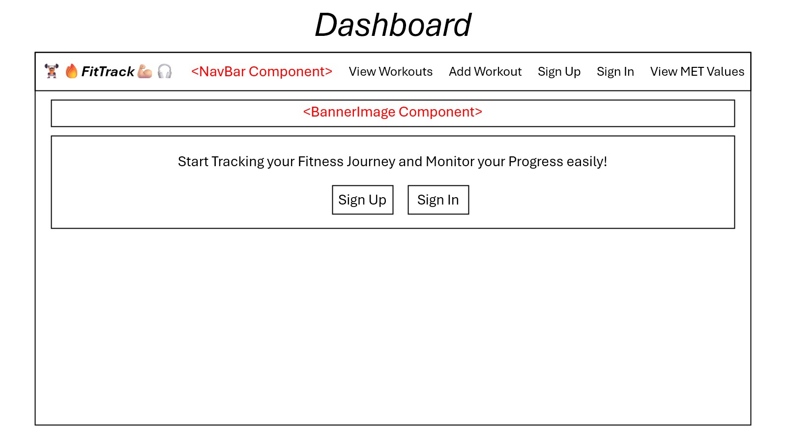

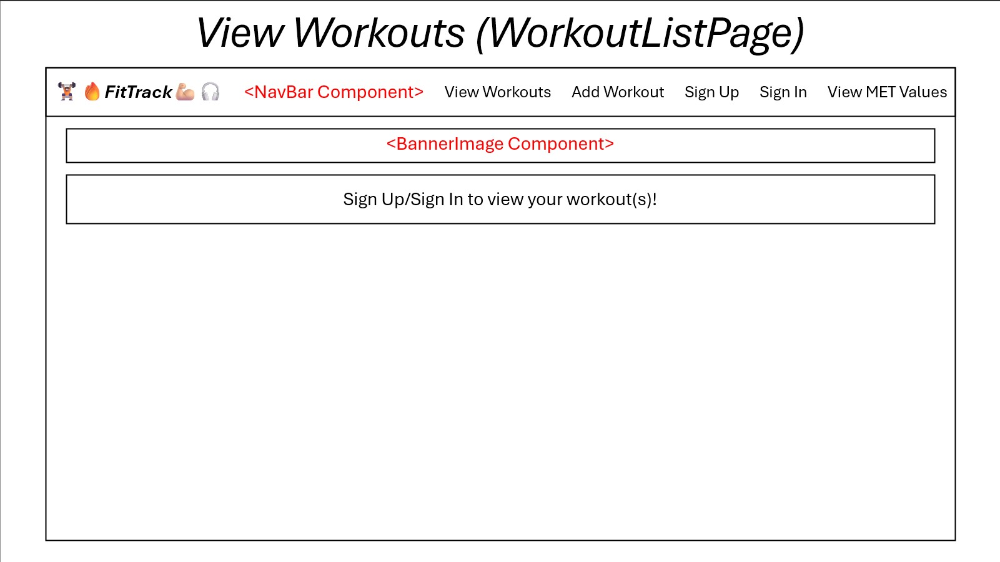

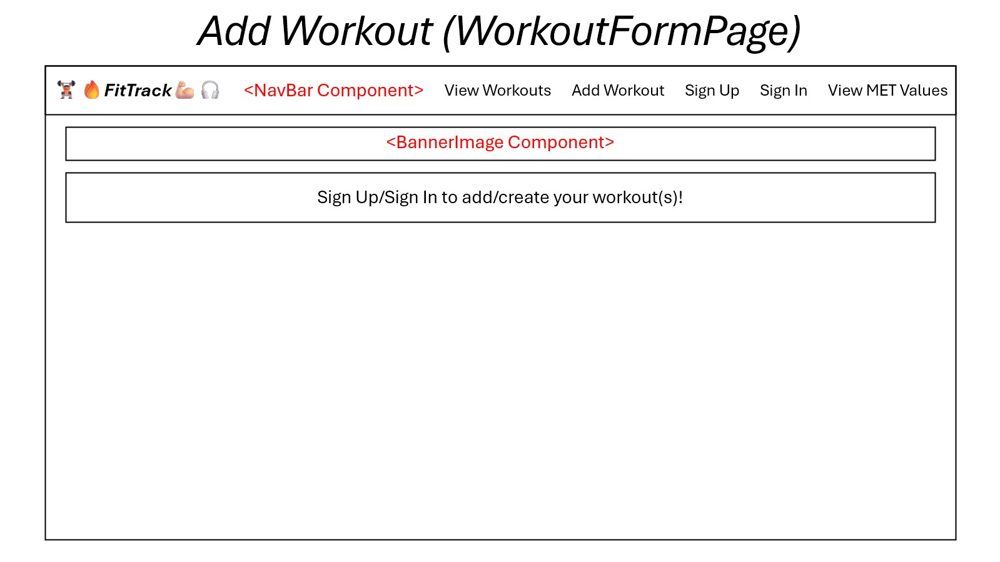

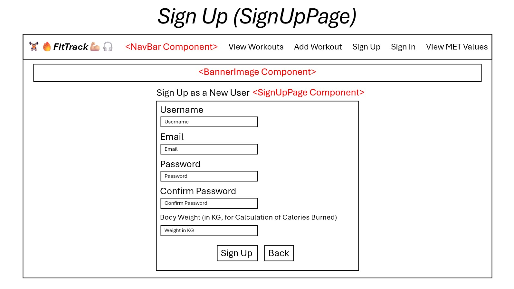

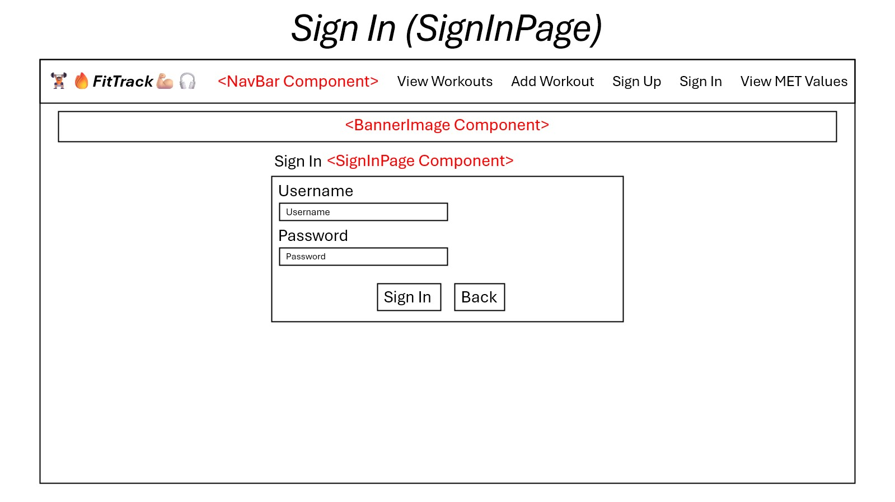

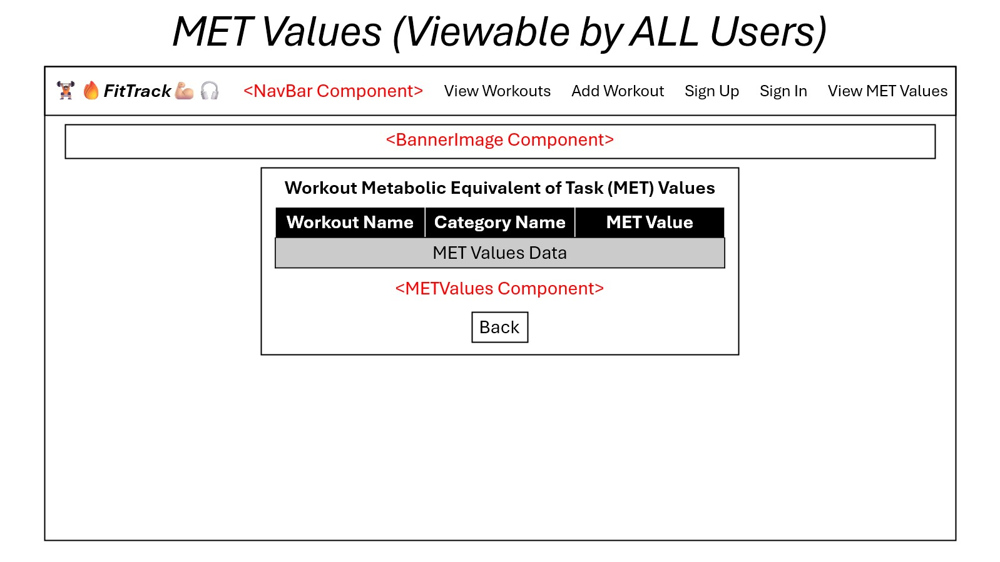

### User

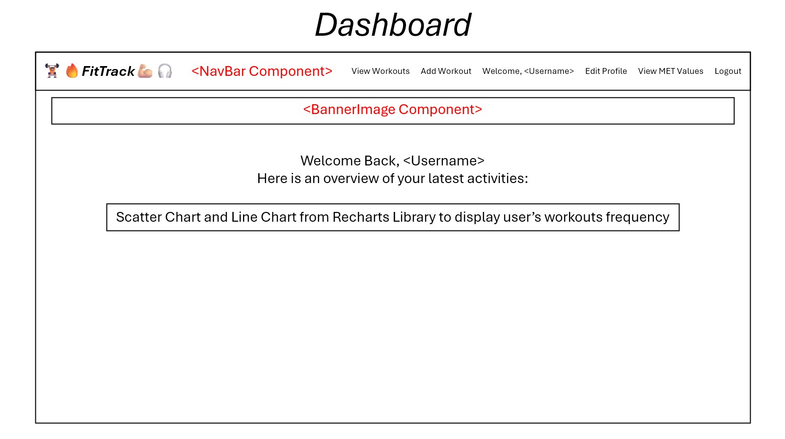

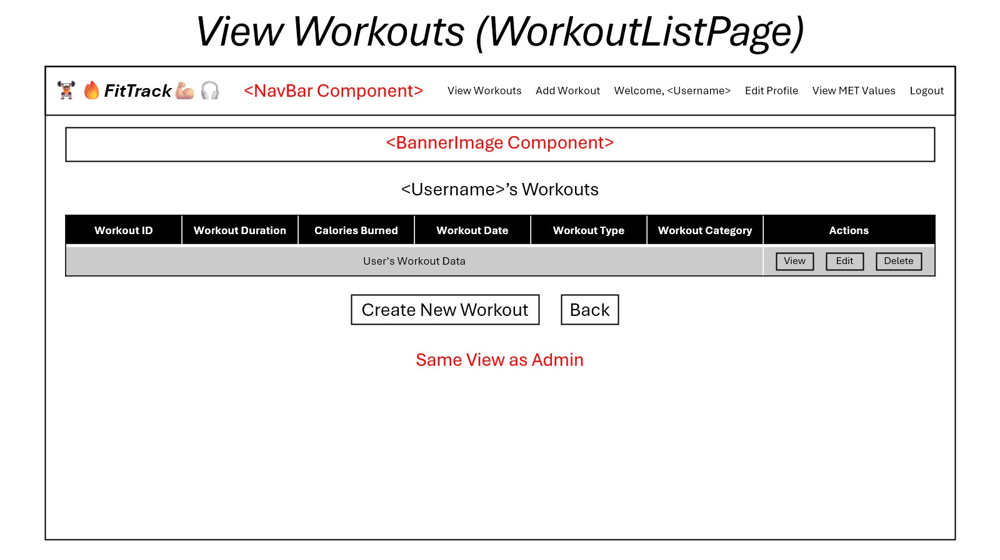

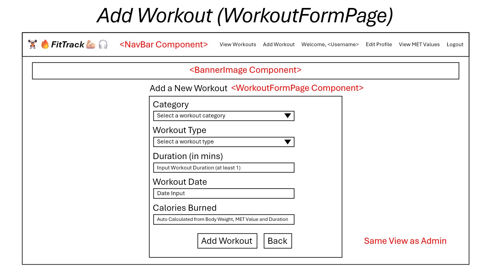

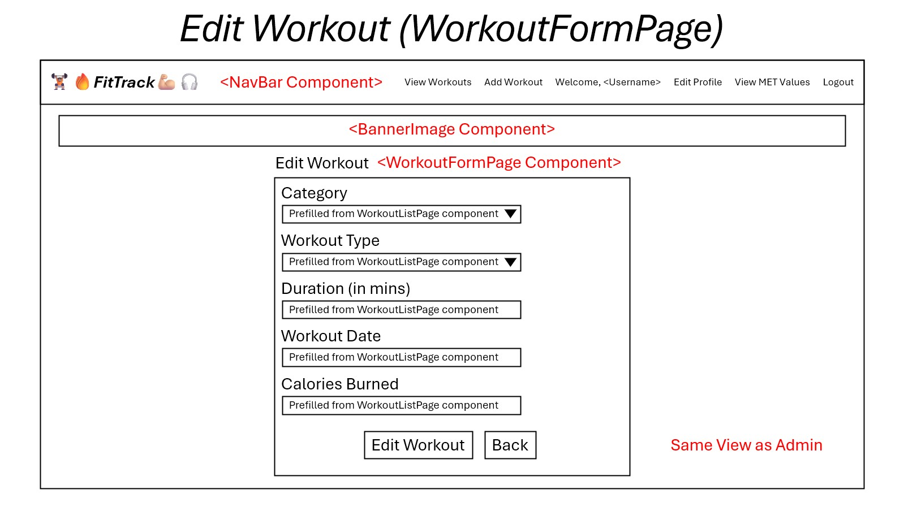

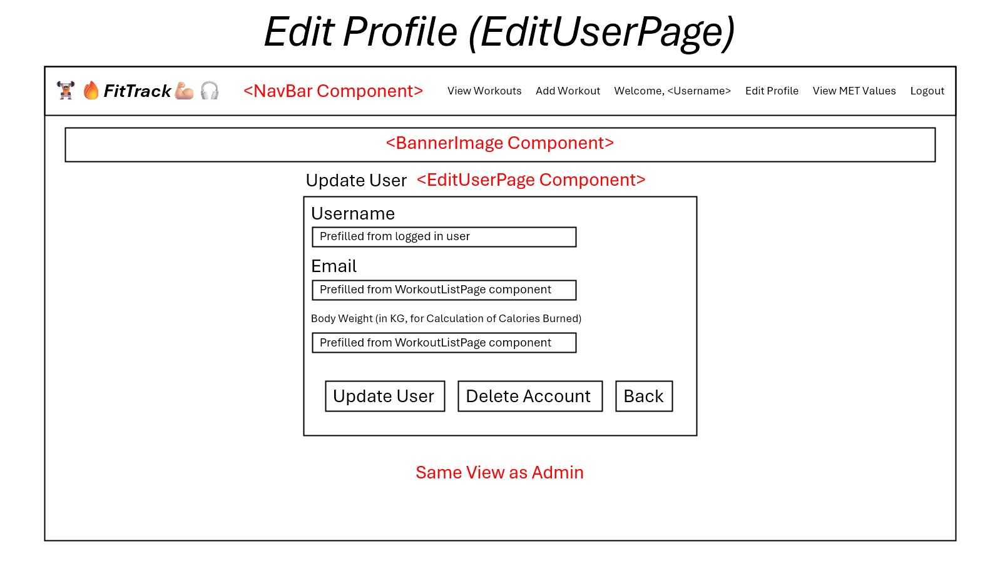

### Admin

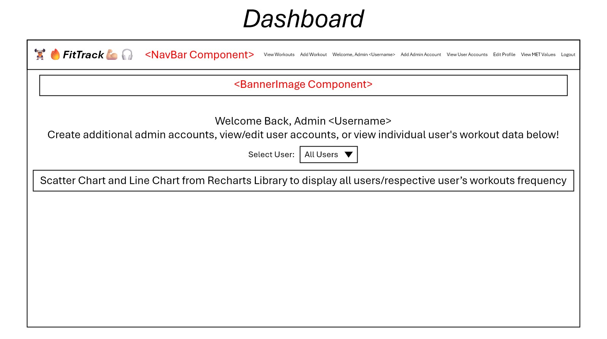

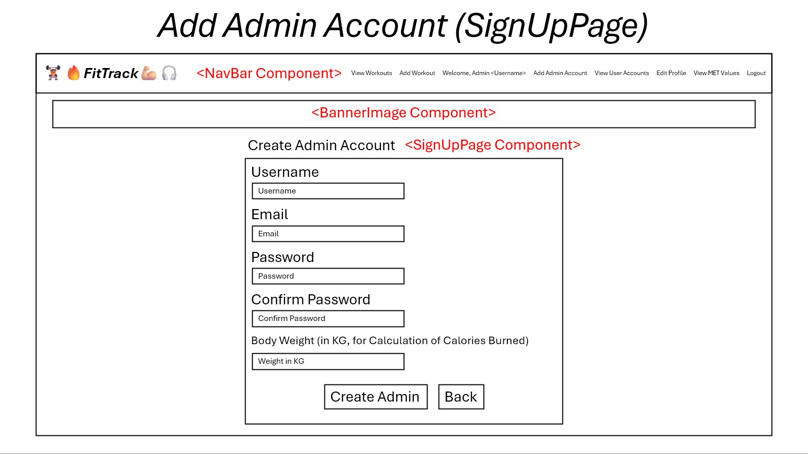

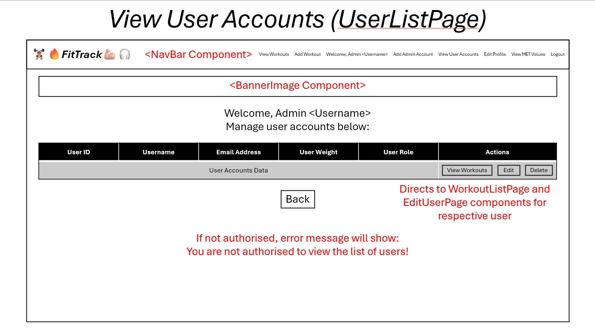

## References:
- TanStack Query: https://tanstack.com/query/latest/docs/framework/react/overview
- Flask: https://flask.palletsprojects.com/en/stable/
- psycopg (Python PostgreSQL Adapter): https://www.psycopg.org/psycopg3/docs/index.html
- PyJWT (JWT Authentication used in Flask): https://pyjwt.readthedocs.io/en/stable/api.html
- Jotai: https://jotai.org/docs
- Daisy UI: https://daisyui.com/components/
- Tailwind CSS: https://tailwindcss.com
- Axios: https://axios-http.com/docs/intro
- Axios Interceptors (For Token Expiry in Frontend): https://axios-http.com/docs/interceptors
- MET Values: https://en.wikipedia.org/wiki/Metabolic_equivalent_of_task
- Recharts (React Component-based Library for displaying User Workout Frequency): https://recharts.org/en-US/api/